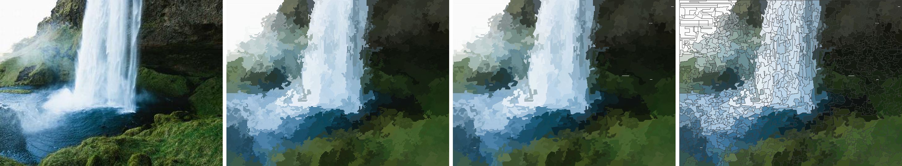

# svg_workspace — 影像轉 SVG(Entropy Rate Superpixel)

一個網頁工具:**上傳一張點陣影像(JPEG/PNG…),用熵率超像素(Entropy Rate
Superpixel, ERS)分割後,下載向量化的 SVG。**

- **UI**:`0.0.0.0:48489`(單一來源,純標準函式庫的 HTTP server)
- **UX**:使用者上傳影像 → 下載 SVG
- **Logic**:對影像套用 **Entropy Rate Superpixel** 分割,每個超像素以其平均色填成一個
  `<path>`,邊界由像素格精確描出(矩形多邊形,`fill-rule:evenodd` 正確處理鏤空)。



*左:輸入照片 · 中:輸出 SVG 所畫的內容 · 右:超像素邊界(黃)。*

---

## 執行

```bash
bash ~/svg_workspace/run.sh      # 啟動 0.0.0.0:48489
# 瀏覽器打開  http://<這台機器的IP>:48489/
```

只需 Python 3 標準函式庫 + `numpy` + `Pillow`(本機皆已具備,無需 pip、無 .env)。

操作:拖曳/選一張圖 → 調整參數 → **轉換成 SVG** → **下載 SVG**。頁面可切換「原圖 / SVG 結果」。

---

## 這就是真正的 Entropy Rate Superpixel

`ers.py` 忠實實作:

> Ming-Yu Liu, Oncel Tuzel, Srikumar Ramalingam, Rama Chellappa,
> **"Entropy Rate Superpixel Segmentation"**, CVPR 2011.

流程:

1. 以 4- 或 8-鄰把像素建成無向圖,邊權
   `w_ij = exp(-‖c_i − c_j‖² / (2σ²))`(σ² 預設取所有邊色差平方的平均,對每張圖自適應)。
2. 貪婪地挑選邊集合 `A`,最大化

   `F(A) = H(A) + λ·B(A)`

   其中 `H(A)` 是**隨機漫步的熵率**(平穩分布由完整圖以自環固定),`B(A) = H(Z_A) − N_A`
   是**平衡項**(鼓勵大小相近的超像素)。`F` 單調且次模,故用 **lazy greedy(Minoux)**
   即可重現標準貪婪解。加入一條連接兩個不同群的邊 = 合併兩群;當恰好剩下 `K` 個連通分量
   (超像素)時停止 —— 所選邊集是一棵有 `K` 棵樹的生成森林。

實作為純 `numpy` + 標準函式庫:初始堆積向量化建立;熱迴圈以 Python list、內聯增益數學運算,
邊界描繪與面積(shoelace)對照像素數已驗證為**完全一致(含鏤空)**。

`svgize.py` 把標籤圖轉成 SVG:精確描出每個區域的矩形邊界迴圈、以平均色填色;
SVG 以**原始尺寸**輸出(`width/height` = 原圖,`viewBox` = 分割格,向量與解析度無關)。

### 去鋸齒:不逐像素、階梯轉斜線(watertight)

逐像素描邊界會讓斜線變成**階梯狀鋸齒**(全是短水平/垂直線)。這裡的作法把多餘的階梯點**丟掉**,
讓斜邊直接以斜線呈現,關鍵是**相鄰兩區塊必須丟掉完全相同的點**,否則兩塊填色之間會裂開縫或重疊:

1. **接點(junction)固定不動**:凡是**≥3 個區域交會**、對角棋盤式夾點、或影像四角的格點,一律標記為
   錨點(anchor)保留不動 —— 因為那裡兩區的邊界表示法可能分歧。
2. **兩錨點之間的每一段**用 Douglas–Peucker 化簡(容差 = `smooth`,像素為單位):單位階梯會被丟成
   一條乾淨斜線,真正彎曲的邊界則保留形狀。因為這一段對**相鄰兩區而言是同一串點(只是反向)**,
   化簡時**先正規化方向**(較小端點在前)再跑 DP,兩邊得到**完全相同**的點 → 接合處緊密不留縫。
3. 每個 `<path>` 再加一條**與填色同色的細描邊**,封住瀏覽器在相鄰多邊形共邊處的抗鋸齒髮絲縫。

驗證(400 超像素、精確 point-in-polygon):`smooth=0` 完全密合(0.000%);`smooth=0.9` 僅約
**0.03%** 的次像素縫隙(數個點,已被同色描邊覆蓋),同時水平/垂直線段由 **96% 降到 ~43%**、
檔案更小(逐像素 241KB → 平滑後 ~135KB)。

---

## 參數(頁面左欄)

| 參數 | 意義 | 預設 |
|---|---|---|
| **超像素數量 nseg** | 目標超像素數 `K` | 250 |
| **平衡權重 λ** | 越大 → 超像素大小越均勻 | 0.5 |
| **連通性** | 4-鄰 / 8-鄰 | 8 |
| **分割解析度(長邊)** | 分割前先把長邊縮到此值,只影響精細度與耗時;**SVG 仍以原尺寸輸出** | 200 |
| **邊界平滑(去鋸齒)** | DP 容差(像素)。0 = 逐像素方塊邊界;越大 → 階梯轉斜線越徹底(接點固定、watertight) | 0.9 |
| **畫出區塊邊線** | 是否為每個 `<path>` 加(可見顏色的)描邊 | 關 |

> **關於耗時**:ERS 的貪婪合併是 Python 迴圈,耗時主要由**分割解析度**決定
> (長邊 200 約 5–9 秒、256 約 15 秒;因平衡項會隨群大小改變而使增益全域更新,lazy greedy
> 天生有此開銷)。因此預設把分割縮到長邊 200 求即時感;**輸出 SVG 不受此縮放影響尺寸**。

---

## SVG 編輯器(前端外掛,裁切線以上色塊)

轉換完成後按 **編輯 SVG(裁切線以上色塊)**,會開啟一個**全螢幕畫布編輯器**(前端外掛
`editor.js`,以 HTML5 canvas 繪製,開啟時隱藏其餘所有 UI/文字/按鈕):

1. **載入 SVG 並以 canvas 繪製**,支援**滾輪縮放**與**拖曳平移**(工具列可切換 🖐 移動 / ✏️ 畫線)。
2. 在畫布上**隨手畫一條線**(由左至右)。
3. 按 **✂️ 移除線以上** → 把**線以上(y 方向朝上)**的所有封閉色塊移除(以各色塊的**面積形心**是否
   落在「線以上」區域判定;畫線時會即時**紅色預覽**將被移除的色塊)。可反覆畫線、多次裁切;↺ 復原全部。
4. **⬇️ 下載 SVG** → 匯出裁切後的新 SVG(以瀏覽器 DOM 解析/序列化,保留原 `viewBox`、屬性與封縫描邊,
   只移除被裁掉的 `<path>`)。

> 快捷鍵:`D` 切換畫線/移動,`Esc` 關閉。「線以上」的判定會把畫線兩端**水平延伸到左右邊界、上緣封頂**
> 成一個多邊形,再用 point-in-polygon 判斷每個色塊形心是否在內,因此線可以是斜的或彎的。

## 檔案

| 檔案 | 作用 |
|---|---|
| `server.py` | `0.0.0.0:48489` 網頁 + `POST /convert`(body 放影像位元組,參數放 query)回傳 `{svg,…}` + 提供 `/editor.js` |
| `ers.py` | Entropy Rate Superpixel 分割(純 numpy),回傳 `(labels HxW, K)` |
| `svgize.py` | 標籤圖 + 影像 → SVG 字串(精確邊界描繪、去鋸齒平滑、平均色填色、可選描邊) |
| `editor.js` | 前端 SVG 編輯器外掛(canvas 縮放/平移、畫線、移除線以上色塊、下載) |
| `run.sh` | 啟動器 |
| `demo_compare.png` | 範例:原圖 / 逐像素 / 平滑 / 平滑+邊線 對照 |

---

## 誠實的限制

- ERS 是**超像素**分割,不是語意分割;`K` 很小(如 4)時,平衡項會傾向切成大小相近的區塊,
  邊界會較不貼合 —— 這是演算法特性,超像素本就設計給「數十到數百個」的情境。
- SVG 邊界是**像素精確的矩形多邊形**(階梯狀),忠實但未做曲線平滑;若要更平滑可再接
  曲線擬合,目前刻意保持與分割逐像素一致。
- 分割在縮放後的解析度上進行(預設長邊 200),故細節粒度受此限制;可用滑桿提高(較慢)。
